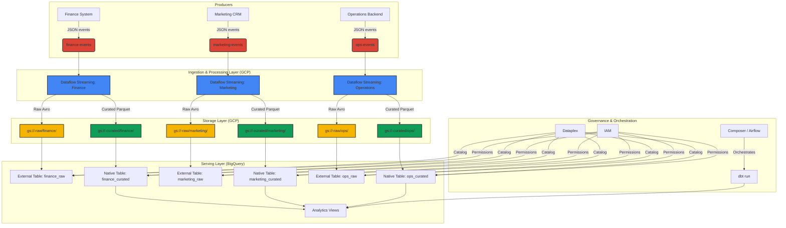

# Enterprise-Scale Data Mesh on Google Cloud


[](https://opensource.org/licenses/MIT)

This repository contains a Proof-of-Concept (PoC) for an Enterprise-Scale Data Mesh architecture on the Google Cloud Platform. It provides a reproducible infrastructure setup using Terraform, demonstrating how to build and manage a decentralized data architecture with centralized governance.

The PoC establishes three distinct data domains: **Finance**, **Marketing**, and **Operations**. Each domain is responsible for its own data pipelines, from ingestion to consumption-ready data products, while a central governance and observability layer ensures consistency and quality across the mesh.

## Quick Start

### Prerequisites

1.  **Google Cloud SDK:** [Install and initialize](https://cloud.google.com/sdk/docs/install).
2.  **Terraform:** [Install v1.8.0+](https://learn.hashicorp.com/tutorials/terraform/install-cli).
3.  **Make:** Ensure `make` is installed on your system.
4.  **gcloud Authentication:** Authenticate with GCP: `gcloud auth application-default login`.
5.  **GitHub Secrets:** Fork this repository and configure the following secrets for the GitHub Actions workflows:
    *   `GCP_PROJECT_ID`: Your development GCP Project ID.
    *   `GCP_SA_KEY`: A JSON service account key with permissions to create the resources.
    *   `TF_STATE_BUCKET`: The name of the GCS bucket to store Terraform state.

### Deployment

1.  **Clone the repository:**
    ```sh
    git clone https://github.com/your-org/data-mesh-gcp.git
    cd data-mesh-gcp
    ```

2.  **Configure your environment:**
    *   Create a GCS bucket for Terraform's remote state.
    *   Update `main.tf` with the name of your state bucket in the `backend "gcs"` block.
    *   Update `envs/dev/terraform.tfvars` with your GCP Project ID.

3.  **Deploy the infrastructure using Make:**
    ```sh
    # Initialize Terraform
    make init

    # See the execution plan
    make plan

    # Apply the changes
    make apply
    ```

4.  **Destroy the infrastructure:**
    ```sh
    make destroy
    ```

---

## Architecture

The architecture is designed around the core principles of a data mesh: domain ownership, data as a product, self-serve data platform, and federated computational governance.



### How It Works

1.  **Ingestion:** Domain-specific producers send JSON events to dedicated Pub/Sub topics (`finance-events`, `marketing-events`, `ops-events`).
2.  **Streaming Processing:** A Dataflow streaming pipeline for each domain subscribes to its topic.
    *   **Raw Zone:** The pipeline first writes the raw, unprocessed events into a domain-specific folder in a central GCS bucket (`gs://<project>-raw/`). The data is stored in Avro format.
    *   **Curated Zone:** The same pipeline then performs transformations (cleansing, standardization, enrichment) and writes the resulting data product to a partitioned folder in another GCS bucket (`gs://<project>-curated/`). The data is stored in Parquet format for analytical efficiency.
3.  **Storage & Serving:**
    *   BigQuery datasets are created for each domain and data layer (`finance_raw`, `finance_curated`, etc.).
    *   The `raw` datasets use external tables to query the Avro files in GCS directly.
    *   The `curated` datasets contain native BigQuery tables, which can be populated by dbt or Spark.
    *   A central `analytics` dataset is used to create conformed views across domains for business intelligence and reporting.
4.  **Transformation:**
    *   A `dbt` project is included to manage the transformation from curated GCS data into the final BigQuery models. These transformations are run on a schedule.
5.  **Orchestration:**
    *   Cloud Composer (managed Airflow) is intended for orchestrating the batch dbt runs and other cross-domain workflows (not fully implemented in this PoC).
6.  **Governance:**
    *   Dataplex would be used to catalog all data assets, providing a centralized discovery and metadata management service.
    *   IAM policies are applied at the dataset level in BigQuery to demonstrate fine-grained access control for data products.

---

## Module Structure

The Terraform code is organized into a modular structure to promote reusability and maintainability.

```
data-mesh-gcp/
├── modules/
│   ├── bigquery/      # Manages BQ Datasets and Tables
│   ├── composer/      # Manages Cloud Composer environments
│   ├── dataflow/      # Manages Dataflow job definitions
│   ├── dataplex/      # Manages Dataplex assets
│   ├── gcs/           # Manages GCS Buckets
│   ├── iam/           # Manages IAM policies
│   └── pubsub/        # Manages Pub/Sub Topics and Subscriptions
├── main.tf            # Root module, calls other modules
└── variables.tf       # Root variables
```

---

## CI/CD

The repository includes two GitHub Actions workflows:

1.  `terraform.yml`: This workflow automates the Terraform lifecycle.
    *   On **pull requests**, it runs `terraform plan` to validate changes.
    *   On **pushes to `main`**, it runs `terraform apply` to deploy changes to the `dev` environment.
2.  `dataflow_build.yml`: This workflow builds and publishes Dataflow Flex Templates.
    *   It triggers on changes within the `pipelines/` directory.
    *   It uses a matrix strategy to build a Docker image and template for each data domain (`finance`, `marketing`, `ops`).

This automated process ensures that infrastructure and data pipelines are continuously tested and deployed, reducing manual effort and risk. 